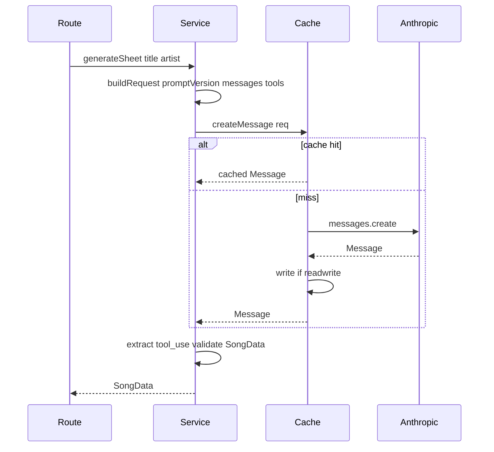
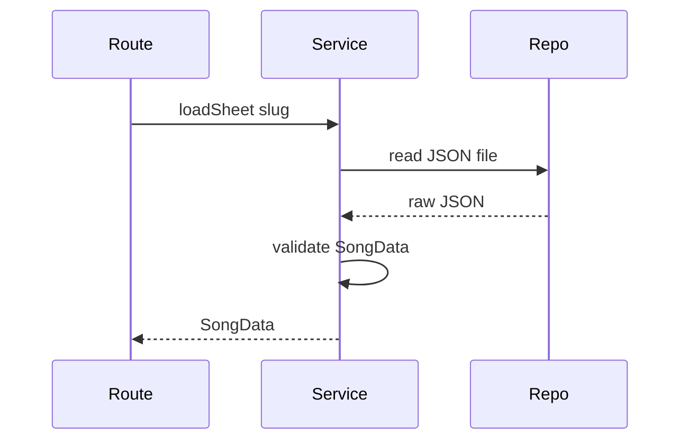

# Plan: LLM caching, saved SongData, prompt extraction, and testing

**Status:** design / not yet implemented

**Decisions:**

- Gitignored dev LLM cache plus small committed **golden fixtures** for CI; record CLI hits the real API to capture goldens.
- **Committed SongData JSON** in the repo (not gitignored) so sheets can be generated **without** an LLM call—same shape as the tool output (`SongData` in `@maple/types`).
- **Prompt fingerprint** includes only what is sent to the model; React/renderer iteration stays cheap when the LLM payload is unchanged (see [Fingerprint boundary](#fingerprint-boundary-react-vs-llm)).

**Overview:** Introduce a prompt-versioned **LLM** cache (local gitignored + committed CI goldens), an injectable LLM boundary for mocks, and a record CLI—while extracting prompts/schemas so service-side logic can grow without breaking cache keys or tests. In parallel, add a **repo-backed SongData** path (validate JSON → return `SongData`) and a clear story for **multiple template formats** without conflating layout experiments with model request identity.

## Goals

1. **Iterative development:** When the **LLM request** (system + tools + user template + model) matches a previous run, use a **cache hit** (dev dir or goldens) and avoid API spend.
2. **Template / React iteration:** Changing **only** client layout or renderer code should **not** invalidate the LLM cache—as long as those details are **not** embedded in prompts or tool schema (see fingerprint boundary below).
3. **Offline sheets:** Load **versioned** `SongData` JSON from the repo, validate, and serve or render **with zero LLM**—for fixtures, demos, and stable regression.

## Implementation checklist

**Phase A — LLM cache, prompts, tests (core)**

- [ ] Add `prompts/` + `mapleSheetTool.ts` + version/fingerprint; slim `generateController`
- [ ] Introduce `LlmClient` interface, Anthropic adapter, file cache with env-driven read/readwrite
- [ ] Move orchestration to `generateService.ts`; controller calls service with `createGenerateDeps()`
- [ ] Add `scripts/record-llm-fixture.ts` and document workflow in `AGENTS.md`
- [ ] Add `test` script, `vitest` config, `.gitignore` `.llm-cache`, committed `fixtures/llm` sample + cache/service tests

**Phase B — Saved SongData (repo, no LLM)**

- [ ] Add zod validation for `SongData` (mirror [`packages/types/src/music.ts`](../packages/types/src/music.ts); consider a shared schema module if duplication becomes painful)
- [ ] Add committed JSON directory (e.g. `apps/api/songs/` or repo-root `songs/`) and `loadSongFromRepo(slug | path)` → parse → validate → return `SongData` (no `LlmClient`, no LLM file-cache read)
- [ ] Expose via API: e.g. `GET /api/sheets/:slug` **or** extend generate input with `source: 'llm' | 'file'` + `slug`—match whatever the client needs
- [ ] Tests: validation-only (invalid JSON, wrong shape) and happy-path load

**Phase C — Multi-template readiness**

- [ ] Document or implement **`layoutTemplateId`** on `SongData` (or a sidecar mapping) when the same schema supports multiple React layouts; fingerprint unchanged if the LLM schema is unchanged
- [ ] If multiple **LLM output shapes** are needed later: separate tools/schemas + include a **`templateFormatId`** (or equivalent) in **both** the user message and fingerprint inputs; goldens keyed per `(fingerprint segment, song slug)`
- [ ] Optional: add **`songSchemaVersion`** inside committed JSON files for forward-compatible evolution before splitting tools

## Current state

- All **LLM** generation lives in [`apps/api/src/generate/generateController.ts`](../apps/api/src/generate/generateController.ts): loads `reference/maple_project_instructions.md`, builds `SYSTEM_PROMPT`, defines a large inline `SONG_DATA_TOOL`, and calls Anthropic directly. There is **no** path yet to load a sheet from a **saved** `SongData` file.
- [`GenerateRequestSchema`](../apps/api/src/generate/generateSchema.ts) is only `title` + `artist` (LLM flow).
- `apps/api/package.json` already lists **vitest** but there is no `test` script and no tests; root `turbo.json` expects a `test` task.

## Design principles

1. **Cache key** must change when _anything material_ to the model changes: not only title/artist, but **prompt version**, **model id**, **tool name/schema** (serialized), and **user message template**. Use a single exported `PROMPT_VERSION` (semver or date) plus an optional **content hash** (e.g. SHA-256 of concatenated system + tools + user template) so you do not forget to bump when editing prose.
2. **Normalize** title/artist for keys (trim, collapse whitespace, case policy—document one rule, e.g. lowercased for key only).
3. **Store** serialized API-shaped payloads (at minimum the assistant `message` JSON or the `tool_use` block you care about) so replay matches the SDK path; parsing stays identical to production.
4. **Separate** “transport” (Anthropic SDK) from “orchestration” (build request → call LLM → extract tool input → validate) so tests mock one narrow interface.

### Fingerprint boundary (React vs LLM)

The fingerprint must include **only** inputs that are actually sent to the API (system string, tool definitions, user message template, model id, etc.). **React/renderer/layout code** is outside that boundary unless you **copy** layout constants or instructions into the prompt—doing so will **bust the cache** on every layout tweak. For **cheap iteration** on UI-only changes, keep layout out of LLM text; rely on the file cache behavior: same `promptFingerprint` + model + normalized title/artist → hit ([Cache key formula](#cache-key-formula-concrete)).

**Multiple formats:** Same `SongData` + different React templates → optional `layoutTemplateId` (or sidecar map); **no** fingerprint change if the LLM schema is unchanged. Different tool schemas per format → include a **format id** in the request and in the fingerprint so caches and goldens do not collide.

## Proposed layout (files)

| Area                | Suggested files                                                                                                                                                                                                                                                                                             |
| ------------------- | ----------------------------------------------------------------------------------------------------------------------------------------------------------------------------------------------------------------------------------------------------------------------------------------------------------- | ---- | ------------------------------------- |
| Prompts             | `apps/api/src/generate/prompts/` — e.g. `instructions.md` (copy or re-export from `reference/` to avoid deep relative paths), `system.ts` (composes final system string), `userMessage.ts` (`buildGenerateUserMessage({ title, artist })`), `version.ts` (`PROMPT_VERSION` + `computePromptFingerprint()`). |
| Tool schema         | `apps/api/src/generate/mapleSheetTool.ts` — `SONG_DATA_TOOL` only (imported by prompt fingerprint).                                                                                                                                                                                                         |
| LLM port            | `apps/api/src/generate/llm/types.ts` + `anthropicAdapter.ts` implementing `createMessage(input) => Message` (typed from SDK or a minimal internal shape).                                                                                                                                                   |
| Cache               | `apps/api/src/generate/llm/fileCache.ts` — wraps the adapter: key → read/write JSON under a base dir.                                                                                                                                                                                                       |
| Service             | `apps/api/src/generate/generateService.ts` — `generateSheet({ title, artist }, deps)` returns `SongData`; **also** `loadSheetFromRepo(slug)` (or similar) for file-backed sheets; future non-LLM transforms stay here.                                                                                      |
| SongData validation | e.g. `apps/api/src/generate/songDataSchema.ts` — zod schema aligned with `@maple/types` `SongData`.                                                                                                                                                                                                         |
| Committed songs     | e.g. `apps/api/songs/*.json` or `songs/*.json` at repo root (committed, not gitignored).                                                                                                                                                                                                                    |
| Controller          | Thin: validate with `generateSchema` / sheet schema, call service, map errors to HTTP.                                                                                                                                                                                                                      |
| Wiring              | `apps/api/src/generate/createGenerateDeps.ts` (or inline in `app.ts`) reads env: `MAPLE_LLM_CACHE=off                                                                                                                                                                                                       | read | readwrite`, paths for dev vs goldens. |

**Directories**

- **Gitignored dev LLM cache:** e.g. `apps/api/.llm-cache/` (add to `.gitignore`).
- **Committed LLM goldens (CI):** e.g. `apps/api/fixtures/llm/<promptFingerprint>/slugified-title-artist.json` for a tiny set (1–3 songs).
- **Committed SongData (no LLM):** e.g. `apps/api/songs/` or `maple/songs/` — validated `SongData` JSON for offline generation and stable demos.

## Saved SongData (repo, no LLM)

- **Artifact:** JSON documents that validate as `SongData`—the same conceptual output as `generate_maple_sheet` tool input (see [`packages/types/src/music.ts`](../packages/types/src/music.ts)).
- **Flow:** read file → parse JSON → validate with zod → return `SongData`. No Anthropic call and **no** LLM response cache lookup (this is a different axis from `.llm-cache`).
- **API:** choose one style and document it: dedicated `GET /api/sheets/:slug` **or** extend the generate endpoint with `source: 'llm' | 'file'` plus `slug`.

## Multiple template formats (future-friendly)

- **Same `SongData`, different React templates:** e.g. `layoutTemplateId` on `SongData` or an external mapping file. LLM fingerprint and cache keys **unchanged** if the tool schema and prompts are unchanged; the client selects the layout.
- **Different LLM outputs per format (different tool schemas):** separate tool definitions; pass a **`templateFormatId`** (or equivalent) into `buildGenerateUserMessage` / tool selection. Include that id in **fingerprint inputs** and in goldens layout (per fingerprint segment + song).

## Cache key formula (concrete)

```
cacheKey = sha256(
  promptFingerprint + "|" + model + "|" + normalize(title) + "|" + normalize(artist)
)
```

Filename: `{cacheKey}.json` or human-readable folder + hash suffix—your choice; hash-only avoids collisions, slug + hash is easier to browse.

`promptFingerprint` = hash of: full system string + JSON-stringify(tool schemas in stable key order) + user template _with placeholders_ (not filled values) so the same template still matches; **or** simpler v1: `PROMPT_VERSION` string that you bump whenever any of those change (less automatic, easier to reason about). **Recommendation:** hash for safety + keep `PROMPT_VERSION` in the JSON metadata for debugging.

## Record CLI

- Script: e.g. `apps/api/scripts/record-llm-fixture.ts` (run via `pnpm --filter @maple/api exec tsx scripts/record-llm-fixture.ts "Title" "Artist"`).
- Behavior: `readwrite` against **committed fixtures path** (or flag `--golden` vs `--dev-cache`), call real adapter once, write JSON + print path and `promptFingerprint`.
- Document in `AGENTS.md`: when to re-record after prompt edits (bump version / rerun record).

## Testing strategy

1. **Unit tests (vitest)** on `generateService`: inject a fake `LlmClient` that returns a minimal valid `tool_use` payload; assert HTTP-irrelevant behavior and future post-processing.
2. **Cache tests:** temp dir as cache root; `read` returns stored message without calling SDK; `readwrite` persists; miss passes through to mock “real” client.
3. **Repo SongData tests:** invalid/malformed JSON; missing fields; happy path matches `SongData` shape.
4. **Optional integration test:** supertest `POST /api/generate` (and/or sheet route) with deps factory forcing fake LLM or file source (only if you want route-level confidence; otherwise service tests suffice).
5. **CI:** `pnpm test` uses **committed goldens** only (no API key); optional separate `record` / `e2e` job with secret key if you ever want live API checks (not required initially).

Add to `apps/api/package.json`: `"test": "vitest run"` and wire turbo (ensure `@maple/api` exposes `test`).

## Env vars (suggested)

- `MAPLE_LLM_CACHE` — `off` | `read` | `readwrite` (dev default could be `readwrite` locally, `off` in prod).
- `MAPLE_LLM_CACHE_DIR` — override path (dev vs goldens).
- Existing `ANTHROPIC_API_KEY` unchanged.

## Flow (mermaid)

LLM path (cached):



File path (no LLM):



## Migration notes

- Moving logic out of the LLM: implement as **pure functions** in `generateService.ts` (or `postProcessSheet.ts`) with inputs = model output + request context; unit test those functions without any SDK. Cache still keys off **LLM request** fingerprint; post-processing runs **after** cache read so refactors to service code do not require re-recording unless you change what you ask the model.
- Keep **tool schema** in one module so changing it invalidates fingerprint and forces new fixtures.
- **Committed SongData** can evolve independently: prefer optional **`songSchemaVersion`** in JSON if you need migrations before introducing multiple LLM tool shapes.

## Open decisions (pick at implementation time)

- **Routing:** stable **`slug`** derived from filename (e.g. `kebab-title--artist.json`) vs explicit **`slug` field** inside JSON—choose one for URLs and duplicate avoidance.
- **API shape:** dedicated **`GET /api/sheets/:slug`** vs **`source` + `slug`** on the existing generate route.

## Out of scope (unless you want later)

- Redis/shared cache for multi-instance prod (file cache is enough for dev + CI goldens).
- Encrypting cached responses (local dev / committed JSON is usually plain).
