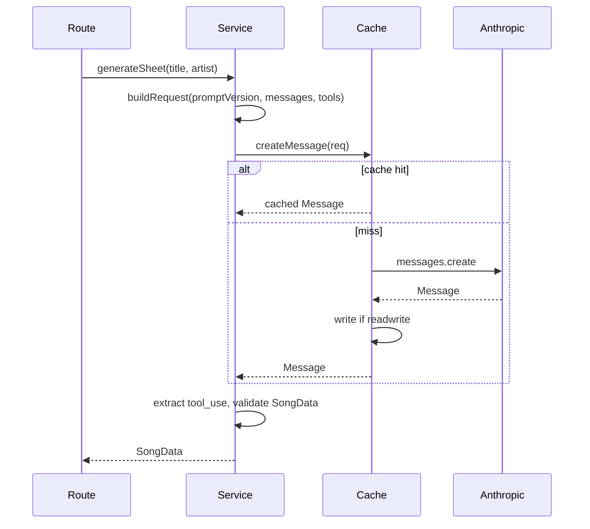

# Plan: LLM caching, prompt extraction, and testing

**Status:** design / not yet implemented  
**Decisions:** gitignored dev cache plus small committed golden fixtures for CI; record CLI hits the real API to capture fixtures.

**Overview:** Introduce a prompt-versioned cache (local gitignored + committed CI goldens), an injectable LLM boundary for mocks, and a record CLI—while extracting prompts/schemas so service-side logic can grow without breaking cache keys or tests.

## Implementation checklist

- [ ] Add `prompts/` + `mapleSheetTool.ts` + version/fingerprint; slim `generateController`
- [ ] Introduce `LlmClient` interface, Anthropic adapter, file cache with env-driven read/readwrite
- [ ] Move orchestration to `generateService.ts`; controller calls service with `createGenerateDeps()`
- [ ] Add `scripts/record-llm-fixture.ts` and document workflow in `AGENTS.md`
- [ ] Add `test` script, `vitest` config, `.gitignore` `.llm-cache`, committed `fixtures/llm` sample + cache/service tests

## Current state

- All generation lives in `apps/api/src/generate/generateController.ts`: loads `reference/maple_project_instructions.md`, builds `SYSTEM_PROMPT`, defines a large inline `SONG_DATA_TOOL`, and calls Anthropic directly.
- `apps/api/package.json` already lists **vitest** but there is no `test` script and no tests; root `turbo.json` expects a `test` task.

## Design principles

1. **Cache key** must change when *anything material* to the model changes: not only title/artist, but **prompt version**, **model id**, **tool name/schema** (serialized), and **user message template**. Use a single exported `PROMPT_VERSION` (semver or date) plus an optional **content hash** (e.g. SHA-256 of concatenated system + tools + user template) so you do not forget to bump when editing prose.
2. **Normalize** title/artist for keys (trim, collapse whitespace, case policy—document one rule, e.g. lowercased for key only).
3. **Store** serialized API-shaped payloads (at minimum the assistant `message` JSON or the `tool_use` block you care about) so replay matches the SDK path; parsing stays identical to production.
4. **Separate** “transport” (Anthropic SDK) from “orchestration” (build request → call LLM → extract tool input → validate) so tests mock one narrow interface.

## Proposed layout (files)

| Area | Suggested files |
|------|-----------------|
| Prompts | `apps/api/src/generate/prompts/` — e.g. `instructions.md` (copy or re-export from `reference/` to avoid deep relative paths), `system.ts` (composes final system string), `userMessage.ts` (`buildGenerateUserMessage({ title, artist })`), `version.ts` (`PROMPT_VERSION` + `computePromptFingerprint()`). |
| Tool schema | `apps/api/src/generate/mapleSheetTool.ts` — `SONG_DATA_TOOL` only (imported by prompt fingerprint). |
| LLM port | `apps/api/src/generate/llm/types.ts` + `anthropicAdapter.ts` implementing `createMessage(input) => Message` (typed from SDK or a minimal internal shape). |
| Cache | `apps/api/src/generate/llm/fileCache.ts` — wraps the adapter: key → read/write JSON under a base dir. |
| Service | `apps/api/src/generate/generateService.ts` — `generateSheet({ title, artist }, deps)` returns `SongData`; future non-LLM logic lives here. |
| Controller | Thin: validate with existing `generateSchema.ts`, call service, map errors to HTTP. |
| Wiring | `apps/api/src/generate/createGenerateDeps.ts` (or inline in `app.ts`) reads env: `MAPLE_LLM_CACHE=off|read|readwrite`, paths for dev vs goldens. |

**Directories**

- **Gitignored dev cache:** e.g. `apps/api/.llm-cache/` (add to `.gitignore`).
- **Committed goldens:** e.g. `apps/api/fixtures/llm/<promptFingerprint>/slugified-title-artist.json` for a tiny CI set (1–3 songs).

## Cache key formula (concrete)

```
cacheKey = sha256(
  promptFingerprint + "|" + model + "|" + normalize(title) + "|" + normalize(artist)
)
```

Filename: `{cacheKey}.json` or human-readable folder + hash suffix—your choice; hash-only avoids collisions, slug + hash is easier to browse.

`promptFingerprint` = hash of: full system string + JSON-stringify(tool schemas in stable key order) + user template *with placeholders* (not filled values) so the same template still matches; **or** simpler v1: `PROMPT_VERSION` string that you bump whenever any of those change (less automatic, easier to reason about). **Recommendation:** hash for safety + keep `PROMPT_VERSION` in the JSON metadata for debugging.

## Record CLI

- Script: e.g. `apps/api/scripts/record-llm-fixture.ts` (run via `pnpm --filter @maple/api exec tsx scripts/record-llm-fixture.ts "Title" "Artist"`).
- Behavior: `readwrite` against **committed fixtures path** (or flag `--golden` vs `--dev-cache`), call real adapter once, write JSON + print path and `promptFingerprint`.
- Document in `AGENTS.md`: when to re-record after prompt edits (bump version / rerun record).

## Testing strategy

1. **Unit tests (vitest)** on `generateService`: inject a fake `LlmClient` that returns a minimal valid `tool_use` payload; assert HTTP-irrelevant behavior and future post-processing.
2. **Cache tests:** temp dir as cache root; `read` returns stored message without calling SDK; `readwrite` persists; miss passes through to mock “real” client.
3. **Optional integration test:** supertest `POST /api/generate` with deps factory forcing fake LLM (only if you want route-level confidence; otherwise service tests suffice).
4. **CI:** `pnpm test` uses **committed goldens** only (no API key); optional separate `record` / `e2e` job with secret key if you ever want live API checks (not required initially).

Add to `apps/api/package.json`: `"test": "vitest run"` and wire turbo (ensure `@maple/api` exposes `test`).

## Env vars (suggested)

- `MAPLE_LLM_CACHE` — `off` | `read` | `readwrite` (dev default could be `readwrite` locally, `off` in prod).
- `MAPLE_LLM_CACHE_DIR` — override path (dev vs goldens).
- Existing `ANTHROPIC_API_KEY` unchanged.

## Flow (mermaid)



## Migration notes

- Moving logic out of the LLM: implement as **pure functions** in `generateService.ts` (or `postProcessSheet.ts`) with inputs = model output + request context; unit test those functions without any SDK. Cache still keys off **LLM request** fingerprint; post-processing runs **after** cache read so refactors to service code do not require re-recording unless you change what you ask the model.
- Keep **tool schema** in one module so changing it invalidates fingerprint and forces new fixtures.

## Out of scope (unless you want later)

- Redis/shared cache for multi-instance prod (file cache is enough for dev + CI goldens).
- Encrypting cached responses (local dev / committed JSON is usually plain).
